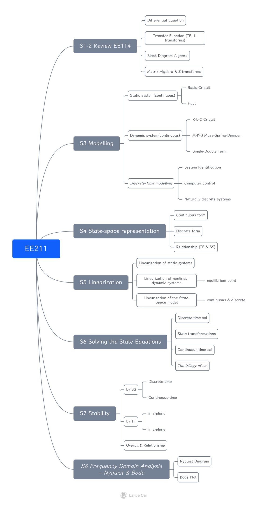
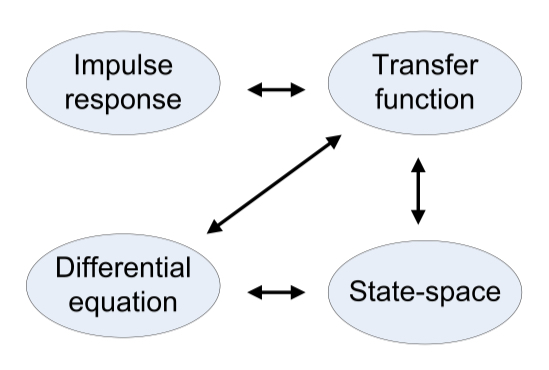
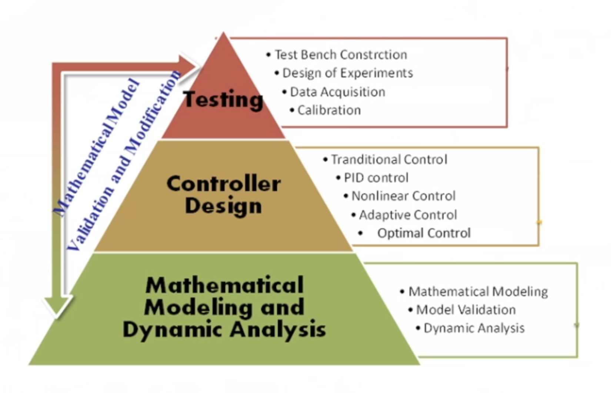
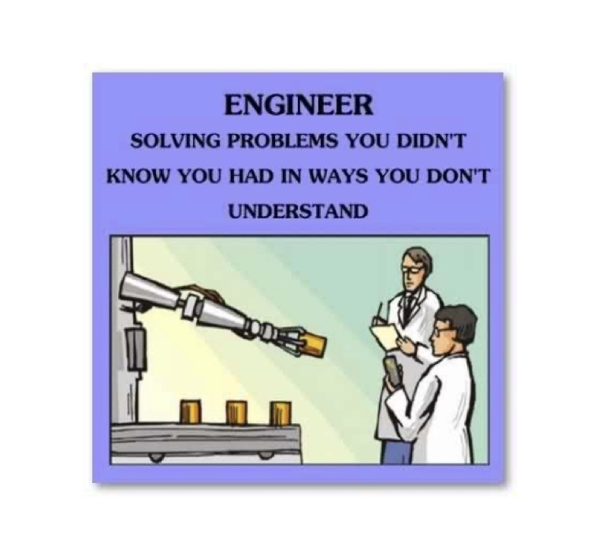
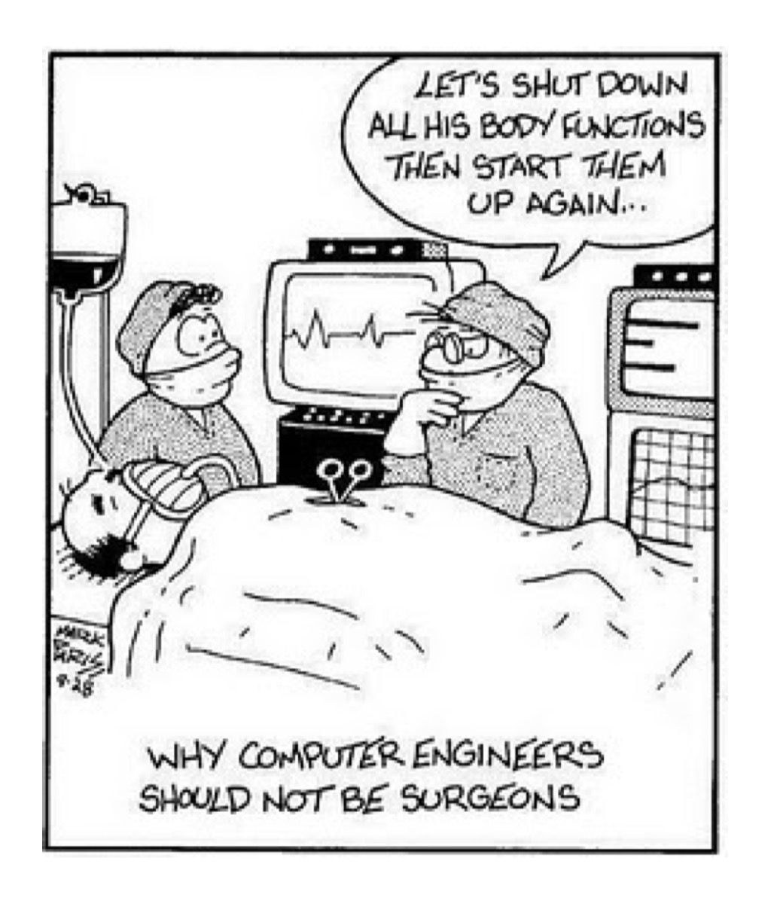

# EE211 System Dynamics Review

## EE211

- S1-2 Review EE114
    - Differential Equation
    - Transfer Function (TF, L-transforms)
    - Block Diagram Algebra
    - Matrix Algebra & Z-transforms
- **S3 Modelling**
    - **Static system(continuous)****
        - Basic Cricuit
        - Heat
    - **Dynamic system(continuous)****
        - R-L-C Cricuit
        - M-K-B Mass-Spring-Damper
        - Single-Double Tank
    - *Discrete-Time modelling*
        - System Identification
        - Computer control
        - Naturally discrete systems
- **S4 State-space representation**
    - Continuous form
    - Discrete form
    - **Relationship (TF & SS)**
- **S5 Linearization**
    - Linearization of static systems
    - Linearization of nonlinear dynamic systems
        - equilibrium point
    - Linearization of the State-Space model
        - continuous & discrete
- **S6 Solving the State Equations**
    - Discrete-time sol
    - State transformations
    - Continuous-time sol
    - *The trilogy of sol*
- **S7 Stability**
    - by SS
        - Discrete-time
        - Continuous-time
    - by TF
        - in s-plane
        - in z-plane
    - **Overall & Relationship**
- *S8 Frequency Domain Analysis – Nyquist & Bode*
    - Nyquist Diagram
    - Bode Plot

## 附上几张有意思的图片：

from EE211 Note

from DR\_CAN

from EE211 Slide

from EE211 Slide

